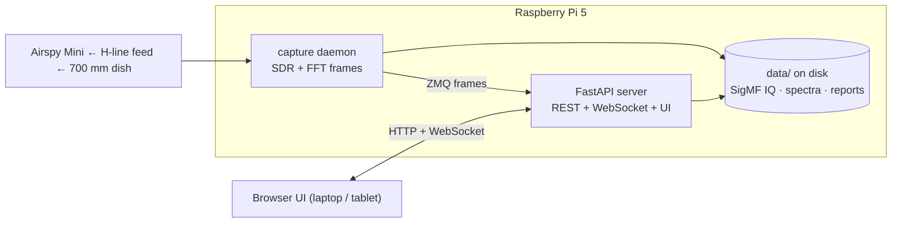

# jansky-observe

[](https://github.com/joebarbere/jansky-observe/actions/workflows/ci.yml)

**Observation management for the Discovery Dish station — plan, run, and record attended radio
observations end to end.**

Station software for a hydrogen-line telescope: KrakenRF Discovery Dish 700 mm + H-line feed
(1420 MHz) → Airspy Mini → Raspberry Pi 5, in Manayunk, Philadelphia. Two tiers: a Python server
side (a FastAPI API server plus a separate SDR-owning capture daemon, so a USB hiccup never takes
down the observation record) and a thin browser UI that works from any laptop or tablet on the
LAN. Sibling of the [`jansky`](https://github.com/joebarbere/jansky) course (whose tested library
this reuses) and [`jansky-research`](https://github.com/joebarbere/jansky-research).



## Status

**M2 — observation records — shipped:** observations, checklists, and the session wizard on a
forward-migrating SQLite schema, astropy pointing + weather, and the read-mostly MCP surface —
on top of M1's first light (real Airspy, live waterfall, captures to `.npz`/SigMF) and M0's
full CI/release/install pipeline. **M3 — confirmation — is in progress.**

| Tag | Milestone | Release means | |
|---|---|---|---|
| `v0.1.0` | M0 | Walking skeleton + the whole CI/release/install pipeline | ✅ done |
| `v0.2.0` | M1 | First light: real Airspy source, capture to `.npz`/SigMF with live disk readout | ✅ done |
| `v0.3.0` | M2 | Observation records, checklists, session wizard | ✅ done |
| `v0.4.0` | M3 | Confirmation: v1 classifier; HI4PI cross-check follows via `jansky-research` | ⏭ current |
| `v0.5.0` | M4 | Reports & photos: PDF export, Virgo/ezRA exporters | |
| `v0.6.0` | M5 | Feature-complete — the `v1.0.0` release candidate | |
| `v1.0.0` | — | After one real end-to-end observing campaign | |

## Quickstart (dev)

Requires the `jansky` repo checked out next to this one (`../jansky`).

```bash
git clone https://github.com/joebarbere/jansky-observe.git   # next to ../jansky
cd jansky-observe
make setup          # uv sync — pinned Python 3.12 env

# Two terminals:
make daemon         # capture daemon, synthetic noise + fake-HI source
make run            # API server at http://localhost:8000

# Open http://localhost:8000 — live waterfall from the synthetic source.
```

`make help` lists the rest (`test`, `cov`, `lint`, `typecheck`, `qemu-install`, …).

### Recording

Captures come in two formats: **`.npz`** (Welch spectra — compact, the default for watching the
line) and **SigMF** (raw IQ — **~43 GB/hour at 3 MSPS**, so mind the live disk-usage readout).
Files land in `data/captures/` in dev and `/var/lib/jansky-observe/captures/` on the Pi. To
switch the Pi between the synthetic source and the real Airspy (first light!):

```bash
curl -fsSL https://github.com/joebarbere/jansky-observe/releases/latest/download/install.sh \
  | sudo bash -s -- --set-source airspy      # or: synthetic
```

(it edits `/etc/default/jansky-observe` and restarts only the capture daemon; the API
server and its records stay up).

### Observing

Sessions run through the **session wizard** (linked from the home page at
`http://raspberrypi.local:8000`): pick a target from the seeded source list, get az/el,
transit time, drift rate, and the weather snapshot, then work the type's checklist — every
tick is persisted with who and when. The seeded observation types form the **observing
ladder**, and it starts with **Sun pointing calibration**: it measures the Δaz/Δel offsets
the server applies to every future pointing display, so do it before anything pointed.

Claude can plan and troubleshoot at the dish too — the server exposes a read-mostly MCP
surface (no bias-tee control, no deletes, by design):

```bash
claude mcp add --transport http jansky-observe http://raspberrypi.local:8000/mcp
```

then `/plan-session` recommends tonight's target and pre-fills a draft observation in the
wizard.

### Confirmation

"Am I actually seeing hydrogen?" gets a code answer, not a vibe. While observing, the live
view carries an **HI badge** — a running SNR computed on the server's accumulating average
spectrum. After the session, the deterministic classifier runs over any `.npz` capture
(`run_classifier` via MCP, or `POST /api/captures/{id}/classify`): baseline fit, peak search
inside the LSR-corrected Doppler window, verdict from SNR (`detected` ≥ 5, `uncertain` 2–5).
Verdicts are stored as `ClassifierResult` rows (classifier name + version) with plots, and
every spectrum is served on either axis (`?axis=mhz|vlsr`). `/analyze-observation` turns the
results into an honest analysis note — verdicts come from code, Claude interprets. The HI4PI
sky cross-check (v2) follows via `jansky-research`.

## Install on the Pi

One prerequisite: a Raspberry Pi 5 running the pinned **Raspberry Pi OS Lite (64-bit) "Trixie"**
image (exact image in [`deploy/OS_IMAGE`](deploy/OS_IMAGE)), flashed with SSH enabled. Everything
else is the install script's job:

```bash
curl -fsSL https://github.com/joebarbere/jansky-observe/releases/latest/download/install.sh | sudo bash
```

Idempotent and re-runnable (re-running upgrades in place); installs apt deps, uv, the release
wheel, udev rules, and the two systemd units, then health-checks itself. Flags: `--version vX.Y.Z`,
`--no-start`, `--uninstall`.

## Layout

```
jansky-observe/
  src/jansky_observe/
    capture/      # SDR-owning daemon: sources, Welch PSD, device profiles, ZMQ publisher
    server/       # FastAPI app: REST, WebSocket live view, templates, waterfall.js
    astro/        # astropy pointing + LSR spectral axes (topocentric ↔ v_LSR)
    confirm/      # deterministic spectrum classifiers (hline_v1; HI4PI cross-check later)
    frames.py     # spectral-frame wire formats (daemon → server → browser)
    synthetic.py  # synthetic noise + fake-HI generators (M0, test fixtures)
    config.py     # JANSKY_OBSERVE_* env settings
  tests/          # pytest, synthetic fixtures only — no hardware in CI
  deploy/         # install.sh, OS_IMAGE, systemd units, udev rules, QEMU install test
  plans/          # the full project plan
  .claude/        # versioned Claude Code skills + agents (see .claude/README.md)
```

## Plan

The full project plan — architecture, data model, integrations, milestones — lives in
[`plans/jansky_observe.md`](plans/jansky_observe.md).

## Siblings

- [`jansky`](https://github.com/joebarbere/jansky) — the radio-astronomy course; this repo
  depends on its library (`jansky.signals`, `jansky.formats`, …).
- [`jansky-research`](https://github.com/joebarbere/jansky-research) — the research repo; once
  the station produces calibrated spectra, self-collected data feeds its slices.

## License

MIT — see [LICENSE](LICENSE).
