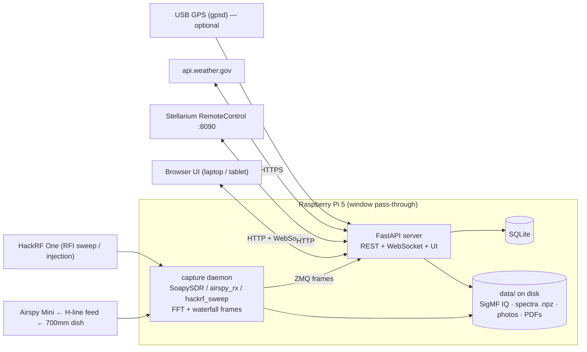
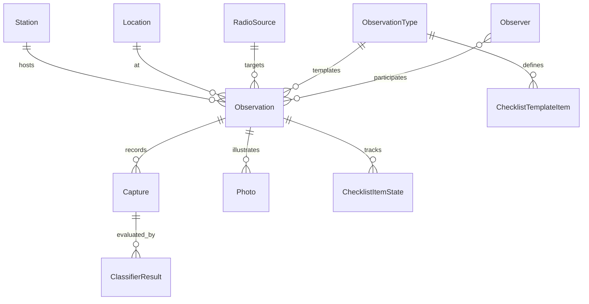

# jansky-observe — project plan

*Observation management for the Discovery Dish station ([[hydrogen_line_telescope_build]]). Sibling of [`jansky`](https://github.com/joebarbere/jansky) (the course) and [`jansky-research`](https://github.com/joebarbere/jansky-research) (the research repo). Drafted 2026-07-11.*

## 1. Goal & guiding principles

**Goal.** A two-tier app (Python server + browser UI) that runs an attended, single-session radio observation end to end: plan it (source, az/el, weather, checklist), run it (live waterfall/spectrum, capture to disk), and record it (notes, photos, classifier confirmation, PDF report). Built for the actual station: KrakenRF Discovery Dish 700 mm + H-line feed (1420 MHz) → Airspy Mini → Raspberry Pi 5, with a HackRF One as test-injection source / second receiver, in Manayunk, Philadelphia.

**Principles.**

- **Session-oriented, attended.** This is not a 24/7 monitoring daemon. An Observation has a start, an end, a human at the dish, and a checklist. Optimize for "tonight I'm going to point at Cygnus and see the HI line."
- **Server owns the data; UI is thin.** All state (SQLite + files on disk) lives server-side. The browser renders what the server sends and never holds truth. Any laptop/tablet on the LAN is a full console.
- **Everything reproducible.** Every capture records the full SDR settings, station config, weather snapshot, and software version — same honesty standard as jansky-research. Raw IQ in SigMF so it's self-describing.
- **Match house conventions.** Python 3.12, `uv`, `pytest` (85% floor on the library core), `ruff` (line-length 100), `mypy`, Makefile, hatchling — identical to the sibling repos. Reuse `jansky` helpers (`jansky.formats` already does SigMF; `jansky.rfi`, `jansky.signals`) rather than reimplementing.
- **Don't reinvent the amateur HI ecosystem.** Virgo and ezRA already do good HI processing; export/import their formats instead of competing (§4.7).
- **Claude-native.** Claude Code is a supported user in all three roles — developer, observer, data analyst. The repo ships its own versioned skills and agents, the API server exposes an MCP surface so Claude is a first-class console peer of the browser UI, and the safety invariants (bias-tee rule) are encoded where an agent can't miss them (§12).

## 2. Architecture

Two tiers, three processes on the server side:

1. **API server** — FastAPI + uvicorn on the Pi 5. Owns SQLite, the REST API, the WebSocket fan-out of live spectra, and serves the UI. This is the only thing the browser talks to.
2. **Capture daemon** — a separate long-lived process (`jansky-observe-capture`) on the Pi that owns the SDR hardware. It streams IQ from the Airspy (SoapySDR, with an `airspy_rx` subprocess fallback), computes FFT frames (numpy/scipy Welch + waterfall rows), writes IQ/spectra to disk, and pushes reduced spectral frames to the API server over a local socket (ZeroMQ PUB or plain TCP + msgpack). Separation matters: a USB hiccup or libairspy crash must not take down the API and the observation record; the API server supervises and restarts it.
3. **Browser UI** — served by the API server; works from any device on the LAN (laptop at the dish, tablet in the yard).

The Pi sits at the window pass-through with the Airspy; the API server runs on the same Pi (a desktop can host it later — the capture daemon is the only piece pinned to SDR-attached hardware, and the daemon→server link is already a socket). Stellarium runs wherever it normally runs (desktop/laptop); the *server* calls its RemoteControl HTTP API, so its host:port is just a Station setting.



**UI stack — one recommendation: Jinja2 + htmx, plus one hand-written canvas module for the live view.** Rationale: every screen except the live view is forms-and-tables CRUD, which htmx does with zero build step, no node toolchain, and all logic in Python — the stack Joe already maintains. The live waterfall/spectrum genuinely needs client-side code either way (WebSocket → `<canvas>` blitting); that's ~300 lines of dependency-free vanilla JS whether the shell is React or htmx, so React would buy a build pipeline without removing the hard part. If the UI ever outgrows this, the REST API is already there for a SPA to consume.

## 3. Data model

SQLite via SQLModel (Pydantic-native, plays well with FastAPI). Files (IQ, spectra, photos, PDFs) live on disk under `data/`, referenced by path from the DB — never blobs in SQLite.



- **Station** — name; dish (diameter, f/D, feed), RF chain description as ordered components (feed → LNA → filter → Airspy Mini …) rendered as a **mermaid diagram** in the UI; compute description; mount type (manual alt-az); notes. One row for now, but a table so a second station is trivial.
- **Location** — name ("Home"), lat/lon/elevation, source (`geocoded` | `gps` | `manual`), address text. An address list; "Home" is default. Geocode once, store forever.
- **Observer** — name, callsign/email, notes.
- **RadioSource** — name, kind (`hi_region` | `point_source` | `sun` | `custom`), RA/Dec (or galactic l/b for HI along the plane), notes. Seeded list: Milky Way HI targets (Cygnus region, galactic anticenter…), Sun, Cas A, Cyg A, Tau A; plus free RA/Dec entry.
- **ObservationType** — name ("HI drift scan", "HI pointed", "RFI survey", "injection test"), description, default SDR settings, and its **ChecklistTemplateItem** rows (ordered text + required flag). Different observation types → different procedure templates.
- **Observation** — name, type, station, location, source, observers (M2M), planned/actual start & end (UTC), status (`planned` | `running` | `done` | `aborted`), **weather snapshot** (JSON captured at start: temp, wind, sky cover, humidity from NWS), pointing record (az/el set on the dish, and computed az/el at start), notes (markdown), **ChecklistItemState** rows (template item → checked bool, checked_at, checked_by — persists exactly what was performed).
- **Capture** — observation FK, device (`airspy` | `hackrf`), file path, format (`sigmf` | `npz_spectra` | `hackrf_sweep_csv`), **size_bytes**, start/end time, and full SDR settings JSON (center freq, sample rate, gains, bias-tee on/off, FFT size, integration time).
- **Photo** — observation FK, file path, caption, **is_highlight** flag (exactly one per observation; larger on PDF/display), taken_at. Stored resized on ingest (Pillow: highlight max 2000 px long edge, others 1200 px, JPEG q85; originals discarded to keep disk honest).
- **ClassifierResult** — capture FK, classifier name+version, verdict (`detected` | `not_detected` | `uncertain`), score, params JSON (e.g. measured peak freq, SNR), created_at, mode (`live` | `post`).

## 4. Integrations

### 4.1 Airspy Mini (primary receiver)
- Sample rates **6 or 3 MSPS** IQ; 12-bit ADC. ⚠️ **Bias-tee rule from the build note:** the Airspy's internal bias tee (4.5 V, ~50 mA) is *not enough* for the 120 mA H-line feed and must stay **OFF** — the feed is powered by the dedicated inline USB-C bias-tee injector. The capture daemon must therefore *never* pass `airspy_rx -b 1` / enable the Soapy bias-tee setting in the H-line profile (enforce it in the device profile, and surface bias-tee state in the checklist). ([airspy.com](https://airspy.com/airspy-mini/), [airspy_rx man page](https://manpages.debian.org/testing/airspy/airspy_rx.1.en.html), power rule in [[hydrogen_line_telescope_build]])
- **Primary path: SoapySDR + SoapyAirspy** with the Python bindings — one streaming API in the capture daemon for both SDRs. ([SoapyAirspy](https://github.com/pothosware/SoapyAirspy), [SoapySDR Python](https://github.com/pothosware/SoapySDR/wiki/PythonSupport))
- **Fallback path: `airspy_rx` subprocess** piping INT16 IQ to stdin — fewer moving parts, easy to debug, and known-good on Pi. The daemon abstracts over both behind one `SDRSource` protocol; ship the subprocess path first, it's an afternoon.
- For HI: 3 MSPS (≈2.4 MHz usable) centered near 1420.4 MHz covers the full galactic HI velocity range (±300 km/s ≈ ±1.4 MHz) with margin.

### 4.2 HackRF One (RFI survey + injection)
- **RFI survey mode:** `hackrf_sweep` sweeps the whole band at up to 8 GHz/s producing binned power vs frequency — perfect for a "what does my window pass-through actually see, 1–2 GHz" pre-session RFI scan stored as a Capture. Parse its CSV output. ([HackRF tools docs](https://hackrf.readthedocs.io/en/latest/hackrf_tools.html), [rtl-sdr.com on hackrf_sweep](https://www.rtl-sdr.com/scanning-spectrum-8ghz-per-second-new-hackrf-update/))
- **Injection test mode:** `hackrf_transfer -t` replays a synthetic 1420.4 MHz-offset tone/noise file into the chain (via attenuator) to validate the whole stack end-to-end — this becomes an ObservationType with its own checklist.
- **Second receiver:** SoapyHackRF later, if ever needed; not v1.
- tinySA Ultra and LiteVNA stay manual bench tools — record their results as photos/notes, don't integrate.

### 4.3 Stellarium
- **RemoteControl plugin** exposes an HTTP API on **port 8090**: `/api/objects/find?str=...` and `/api/objects/info` for object lookup/details, `/api/main/status` for current view, and `POST /api/main/focus` / `POST /api/main/view` (`az`, `alt` params) to slew the *view* to a target. ([API description](https://stellarium.org/doc/23.0/remoteControlApi.html), [plugin docs](https://stellarium.org/doc/24.0/remoteControlDoc.html))
- Use: given the session's RadioSource, the server (a) slews the Stellarium view to it so the desktop shows a finder view, (b) cross-checks its az/alt against astropy's. Stellarium is a *visual aid + sanity check*; **astropy is authoritative** for pointing numbers (works headless on the Pi).
- Telescope Control plugin is not useful until motors exist (§11).

### 4.4 Weather — recommendation: NWS `api.weather.gov`
- Free, **no API key** (just a descriptive `User-Agent`), official US source, ~5000 req/hr — plenty. Flow: `/points/{lat},{lon}` once per Location (returns gridpoint + station URLs, cache it), then `/gridpoints/{wfo}/{x},{y}/forecast/hourly` for planning and `/stations/{id}/observations/latest` for the at-start snapshot. ([NWS API FAQ](https://weather-gov.github.io/api/general-faqs), [gridpoints FAQ](https://weather-gov.github.io/api/gridpoints))
- [Open-Meteo](https://open-meteo.com/) (also free/keyless) is the documented fallback if NWS is down, behind the same internal `WeatherProvider` protocol. Weather is advisory metadata at 21 cm (clouds don't matter; wind on a 700 mm dish and rain on the operator do).

### 4.5 GPS / location
- Default: **no GPS needed.** "Home" is geocoded once (lat/lon/elevation stored in the Location row) — a fixed dish doesn't move.
- Optional: a USB GPS dongle via **gpsd** (`gpsd` + the `gps` Python client, or read NMEA directly with `pynmea2` over serial) adds a "use GPS fix" button that creates/updates a Location — for a future portable setup. ([gpsd](https://gpsd.gitlab.io/gpsd/), [pynmea2](https://github.com/Knio/pynmea2))

### 4.6 astropy (coordinates, time, LSR — critical for HI)
- `EarthLocation` (from the Location row) + `Time` + `SkyCoord.transform_to(AltAz(...))` → live az/el, rise/set, transit time, and **drift rate** (az/el change per minute — how often a manual alt-az dish must be nudged, and how long a source stays in the beam: HPBW ≈ 70·λ/D ≈ 70 × 0.211/0.7 ≈ **21°**, so a source at dec δ crosses the beam in ≈ 21°/(15°·cos δ per hour) — e.g. ~1.8 h for Cyg A, ~2.7 h for Cas A; the wide beam is what makes attended drift scans practical).
- **LSR correction:** the observed HI frequency is shifted by Earth rotation + orbit + solar motion. Use `SpectralCoord` with observer/target and `.with_observer_stationary_relative_to("lsrk")` to convert topocentric frequency → LSR velocity; every saved spectrum stores both the topocentric axis and v_LSR axis. Without this, HI velocities are wrong by up to ~±30 km/s seasonally. ([astropy SpectralCoord docs](https://docs.astropy.org/en/stable/coordinates/spectralcoord.html))
- skyfield is a fine library but astropy already ships in both sibling repos — no reason to add a second ephemeris stack.

### 4.7 Virgo / ezRA interop
- **Virgo** (`astro-virgo`, already an extra in jansky) is a GNU Radio-based spectrometer that saves averaged/calibrated spectra as **CSV** and produces the standard plot set. Its plot layout (averaged spectrum, calibrated spectrum, waterfall, time series, power histogram) is the reference for our live view. Interop: export a Capture's averaged spectrum as Virgo-style CSV. ([Virgo](https://github.com/0xCoto/Virgo), [docs](https://virgo.readthedocs.io/en/latest/index.html))
- **ezRA** collects with ezCol into `.txt` spectrum files and condenses to `.ezb`/`Gal.npz` with ezCon. Interop: an **exporter to ezRA `.txt`** so ezCon/ezGal can post-process jansky-observe data (there is precedent — LRO wrote a GNU Radio script that emits ezRA `.txt`). Import is "later" (§10). ([ezRA](https://github.com/tedcline/ezRA), [LRO ezRA notes](https://www.astronomy.me.uk/14920-2))
- Internal formats stay: SigMF for IQ, `.npz` for spectra — exporters are one-way conveniences.

## 5. Key screens & workflows

### 5.1 Session start wizard
1. Pick/create Observation: name, type (loads checklist template + default SDR settings), observers, location (default Home).
2. Pick source (seeded list, or RA/Dec entry) → server shows **current az/el, transit time, drift rate, beam-crossing time** (astropy), slews the Stellarium view for a finder image, and shows **weather now + next 3 h** (NWS).
3. Point the dish by hand to the displayed az/el; record the set angles.
4. Work the **checklist** (feed connected, bias-tee ON, tinySA sanity check…). Each tick persists with who/when. Weather snapshot auto-saved on "Start".

### 5.2 Live observing view
- **Waterfall** (canvas, WebSocket frames ~2–4 Hz) + **instantaneous spectrum** + **integrated HI profile** (accumulating average, x-axis switchable MHz ↔ v_LSR).
- Capture start/stop (choice: spectra-only `.npz`, or full IQ SigMF — with a **projected & live disk usage** readout: 3 MSPS INT16 IQ ≈ 12 MB/s ≈ 43 GB/h, so the UI must show this *before* you fill the SD card; spectra-only is ~KB/s).
- Live **"am I seeing it?"** indicator (§6), current az/el of the source (it drifts; the dish doesn't), elapsed time, RFI sweep button (HackRF).

### 5.3 Post-session
- Stop → end time recorded, checklist "teardown" section, notes editor.
- Run confirmation classifiers over the captures; results attach as ClassifierResult rows with plots.
- Attach photos (drag-drop; pick the highlight), resized on ingest.
- **Export PDF** (§7). Observation list/detail screens round out the CRUD.

## 6. Confirmation tooling

**v1 — rule-based spectrum classifier (python, testable, ships with M3).**
Input: the averaged spectrum of a capture. Steps: fit/subtract a polynomial baseline (excluding the signal window) → search for peak within **1420.406 MHz ± Doppler window** (window from astropy: the LSR-corrected frequency range for |v_LSR| ≤ 250 km/s at this pointing/time) → verdict from SNR = peak/(baseline RMS): `detected` (SNR ≥ 5), `uncertain` (2–5), `not_detected`. Pure numpy/scipy, synthetic-fixture tested (the jansky-research slice pattern). Also runs **live** on the accumulating average → the "am I seeing it?" badge with running SNR.

**v2 — HI4PI/LAB survey cross-check (M3+, the real confirmation).**
Objective confirmation against professional data, zero labeling required: for the observation's pointing, fetch the **HI4PI** (or LAB) all-sky HI survey spectrum at the same galactic coordinates, convolve it to the dish's ~21° beam, resample both onto a common v_LSR axis, and report the **cross-correlation** between expected and observed profiles (plus peak-velocity agreement). A high correlation is a quantitative "you detected galactic hydrogen *and* the Doppler structure matches the sky" — far stronger evidence than any threshold test, it works from observation #1, and a systematic mismatch doubles as a frequency/pointing-calibration alarm. Survey access via astroquery/VizieR or a one-time HI4PI FITS download cached locally (it's a few GB; the per-pointing cutout is tiny). Verdict thresholds on the correlation + velocity offset feed the same `ClassifierResult` rows (classifier name `hi4pi_xcheck`). This is the recover-a-known validation pattern from jansky-research applied to the rooftop — and it is **the same LAB/HI4PI comparison harness jansky-research plan 78 (station track S2) specifies**, whose offline/synthetic leg can be built and CI'd in that repo now. Build the harness once (in jansky-research, house-tested) and consume it here rather than forking two implementations that will drift.

*(A waterfall image classifier was considered and dropped: an attended station accumulates too few — and too-correlated — labeled observations to train on, the labels would be circular (v1 verdicts confirmed by eye), and the raw spectrum arrays already carry strictly more information than PNG renderings of them. Not worth revisiting; the survey cross-check subsumes it.)*

## 7. PDF export — recommendation: HTML template → WeasyPrint
Jinja2 templates already render the web observation page; WeasyPrint turns a print-CSS variant of the same template into the PDF — one templating system, no reportlab coordinate bookkeeping. ([WeasyPrint](https://weasyprint.org/))

Report contents: header (observation name, date, station, observers) · **highlight photo large** · metadata block (source, RA/Dec + az/el at start, times, location, SDR settings) · weather snapshot · checklist as performed (who/when per item) · integrated HI profile + waterfall images (v_LSR axis) · classifier verdicts · notes · additional photos small (grid) · capture inventory (file, format, size). Saved under `data/observations/<id>/report.pdf` and downloadable.

## 8. Tech stack & repo layout

| Layer | Choice | Why |
|---|---|---|
| Language / tooling | Python 3.12, uv, pytest, ruff, mypy, Makefile, hatchling | House conventions (jansky, jansky-research) |
| API server | FastAPI + uvicorn | Async WebSockets + Pydantic models, minimal ceremony |
| DB | SQLite + SQLModel | Single-user, single-file, zero admin; models double as API schemas |
| Capture daemon | Python; SoapySDR (SoapyAirspy/SoapyHackRF), `airspy_rx`/`hackrf_sweep` subprocess fallback | One streaming API; subprocess path is the reliable v1 |
| DSP | numpy/scipy (Welch PSD, waterfall), `jansky.signals` / `jansky.rfi` helpers | Reuse the course library |
| Astronomy | astropy (EarthLocation, AltAz, SpectralCoord/LSRK) | Already core in both repos |
| IQ format | SigMF (`jansky.formats`) | Self-describing, already implemented |
| UI | Jinja2 + htmx + vanilla-JS canvas live module | No build step; live view is custom JS regardless |
| Weather | NWS api.weather.gov (Open-Meteo fallback) | Free, keyless, official US |
| PDF | WeasyPrint over the same Jinja2 templates | One template system |
| Photos | Pillow resize-on-ingest | Bounded disk use |
| Claude integration | `.claude/` skills + agents versioned in the repo; MCP server mounted on the FastAPI app (fastapi-mcp / FastMCP) | Claude as developer, observer & analyst against the same REST truth (§12) |
| Packaging/deploy | GitHub Release wheel + `install.sh` (apt deps, uv, venv, udev rules, two systemd units); pinned Raspberry Pi OS Lite 64-bit "Trixie" as the sole prerequisite | Install is a release artifact, not a doc page (§9) |
| CI/CD | GitHub Actions: `ci.yml` (x86_64 + native arm64) and `release.yml` with a release-blocking install gate; QEMU full-image install test on the Linux workstation | Every milestone tag ⇒ installable GitHub Release (§9) |

```
jansky-observe/
├── pyproject.toml            # deps: fastapi, uvicorn, sqlmodel, jinja2, astropy, numpy/scipy,
│                             #       pillow, weasyprint, httpx, pyzmq, sigmf (jansky as extra)
├── Makefile                  # setup / test / cov / lint / typecheck / run / daemon
├── CLAUDE.md                 # house conventions + SAFETY INVARIANTS (bias-tee rule) — §12
├── .claude/
│   ├── skills/               # verify, release, synthetic-fixture, plan-session,
│   │                         #   observing-copilot, troubleshoot-chain, analyze-observation,
│   │                         #   compare-observations, write-up
│   └── agents/               # dsp-reviewer.md, hi-data-analyst.md
├── src/jansky_observe/
│   ├── server/               # FastAPI app: routers/ (observations, sources, captures, photos,
│   │                         #   checklists, live-ws), templates/ (Jinja2 + print CSS), static/
│   │                         #   (htmx, waterfall.js)
│   ├── capture/              # daemon: sdr sources (soapy.py, airspy_cli.py, hackrf_sweep.py),
│   │                         #   dsp.py (FFT/waterfall), writer.py (SigMF/.npz), zmq publisher
│   ├── astro/                # pointing.py (AltAz, drift), lsr.py (SpectralCoord), stellarium.py
│   ├── weather/              # nws.py, open_meteo.py behind WeatherProvider protocol
│   ├── confirm/              # v1 rule-based classifier, v2 HI4PI cross-check, plots
│   ├── mcp/                  # MCP tool definitions mounted on the FastAPI app (§12.4)
│   ├── export/               # pdf.py (WeasyPrint), virgo_csv.py, ezra_txt.py
│   └── models.py             # SQLModel entities (§3)
├── tests/                    # pytest + synthetic IQ/spectrum fixtures; no-hardware CI
├── data/                     # gitignored: sqlite db, observations/<id>/{iq,spectra,photos,report.pdf}
├── .github/workflows/        # ci.yml (x86_64 + arm64), release.yml (build → install gate → Release)
└── deploy/                   # install.sh, systemd units, udev rules, OS_IMAGE (pinned Pi OS image),
                              #   qemu/run-install-test.sh (make qemu-install)
```

## 9. CI/CD, releases & install (built at M0, not after)

The pipeline exists **before the features do**: every milestone lands as a git tag + GitHub Release with installable artifacts, and "does it install on a clean Pi OS?" is a release-blocking gate from the very first tag.

### Prerequisites (the only manual setup)

- **Raspberry Pi 5** running **Raspberry Pi OS Lite (64-bit), Debian 13 "Trixie"** — the one assumption. Pin the exact image (name + date) in `deploy/OS_IMAGE` and record it in the README; flash with Raspberry Pi Imager with SSH enabled. `install.sh` checks `/etc/os-release` + `uname -m` (aarch64) and refuses unsupported bases rather than half-installing.
- Network + SSH access to the Pi.
- **Everything else is the install script's job** — no other manual steps are permitted in the docs. If a setup step can't be scripted, it goes in the Prerequisites list or it doesn't exist.

### `install.sh` (shipped as a release asset)

One idempotent, re-runnable script (same house style as the Pi restore script in [[hydrogen_line_telescope_build]]): `curl -fsSL <release-url>/install.sh | bash` or download-inspect-run. It handles: apt packages (airspy/hackrf userland, libusb, pango/cairo for WeasyPrint), pinned `uv`, a venv + the release wheel, udev rules for Airspy/HackRF, data directory, the two systemd units (API server, capture daemon) enabled + started, and a final health check (`curl localhost:8000/healthz` + `jansky-observe --version`). Flags: `--version vX.Y.Z` (default latest), `--no-start`, `--uninstall`. Re-running upgrades in place; the SQLite schema migrates forward on server start.

### Pipeline (GitHub Actions, matching the sibling repos' workflow conventions)

- **`ci.yml`** — every push/PR: ruff, mypy, pytest (synthetic fixtures, no hardware) on `ubuntu-latest` **and `ubuntu-24.04-arm`** (native arm64 runners are free for public repos — same architecture as the Pi), plus wheel build.
- **`release.yml`** — on tag `v*`: full CI matrix → build sdist/wheel → **install gate** → only then create the GitHub Release (auto-generated notes + wheel, `install.sh`, `SHA256SUMS` as assets). The install gate runs on `ubuntu-24.04-arm`: a pristine Debian "Trixie" arm64 container, run `install.sh` pointed at the just-built artifacts (pre-release, local path), assert services start (foreground mode in-container), `healthz` returns OK, and a synthetic-mode capture smoke passes. **A tag whose install gate fails publishes nothing** — this is the guard that the first release (and every release) is actually installable.
- Docs/site can piggyback later; not part of v0.x scope.

### QEMU install test (full-fidelity gate, runs on the Linux workstation)

The CI container gate catches most breakage but isn't Raspberry Pi OS. `deploy/qemu/run-install-test.sh` + `make qemu-install` boots the **pinned genuine Raspberry Pi OS Lite image** headless in `qemu-system-aarch64` (`-M virt -cpu cortex-a76` — the Pi 5's core — kernel/initrd extracted from the image, first-boot user pre-seeded, SSH port-forwarded), then runs the real `install.sh` in the guest over SSH and asserts the same health checks. Image download is cached; a run is minutes, not hours. **Required manually before tagging v0.1.0 and whenever `install.sh` or the OS pin changes** (it's a checklist item in the release procedure); optional otherwise since it's too slow for every push. Honest limits: QEMU emulates the OS and userland, not Pi 5 silicon or USB — SDR hardware smoke (`airspy_rx` actually enumerating) stays a physical checklist item on the real Pi.

### Semver ↔ milestone mapping

Standard pre-1.0 semantics: **minor = milestone** (breaking changes allowed at minor bumps while 0.x), **patch = fixes between milestones**. If a milestone lands in stages, extra minors are fine — the mapping is "milestone complete ⇒ at least this version," not a straitjacket.

| Tag | Milestone | Release means |
|---|---|---|
| `v0.1.0` | M0 | Walking skeleton — **and the whole pipeline**: CI, release workflow, `install.sh`, QEMU gate passed. Installable from day one |
| `v0.2.0` | M1 | First light: real Airspy, live view, captures to disk |
| `v0.3.0` | M2 | Observation records, checklists, session wizard |
| `v0.4.0` | M3 | Confirmation: v1 classifier + HI4PI cross-check |
| `v0.5.0` | M4 | Reports & photos: PDF export, exporters |
| `v0.6.0` | M5 | Feature-complete vs. the original list — doubles as the `v1.0.0` release candidate |
| `v1.0.0` | — | Not a feature: tagged after `v0.6.x` has run **one real observing campaign end-to-end** (plan → observe → confirm → PDF) on the rooftop. 1.0 means "it did its job for real." Post-1.0: schema changes require migrations at minor; breaking = major |

## 10. Milestones (small; the dish is usable at M1)

Every milestone closes the same way: QEMU gate if `install.sh`/OS pin changed → tag → release workflow publishes → `install.sh` upgrade on the real Pi.

- **M0 — walking skeleton + pipeline → `v0.1.0` (~2 weekends).** Repo scaffold to house standards; FastAPI serves one page; capture daemon streams *synthetic* noise+fake-HI frames over ZMQ→WebSocket→canvas waterfall. Plus the whole of §9: `ci.yml`, `release.yml` with the install gate, `install.sh` + systemd units + udev rules, and the QEMU install test passing against the pinned Pi OS image. Plus the developer Claude loop: `CLAUDE.md` with the safety-invariants block, `/verify`, `/release`, `/synthetic-fixture` (§12.6). Proves the whole pipe — code *and* delivery — with no hardware.
- **M1 — first light → `v0.2.0` (~1–2 weekends).** Real Airspy via `airspy_rx` subprocess (bias-tee forced OFF per the power rule), Welch spectra, waterfall + spectrum + accumulating average in the browser, capture start/stop to `.npz` + SigMF with live disk-usage readout. *Everything needed to point the dish and watch for the line* — installed on the Pi via the release, not a git checkout.
- **M2 — observation records → `v0.3.0` (~2 weekends).** Data model + CRUD, checklist templates & persisted state, session wizard (astropy az/el/drift + NWS snapshot), notes, observers, seeded source list. First release where the SQLite schema matters → forward-migration-on-start ships here. Claude: MCP surface mounts on the server, `/plan-session`, `/troubleshoot-chain`, `/new-migration` (§12.6).
- **M3 — confirmation → `v0.4.0` (~1–2 weekends).** v1 rule-based classifier (live badge + post-run), LSR axis on all spectra, classifier plots stored. v2 HI4PI cross-check (survey cutout, beam-convolve, cross-correlate) once v1's spectra are trustworthy. Claude: `/observing-copilot`, `/analyze-observation` + `hi-data-analyst`, `dsp-reviewer` (§12.6).
- **M4 — reports & photos → `v0.5.0` (~1 weekend).** Photo ingest/resize/highlight, WeasyPrint PDF, Virgo-CSV + ezRA-txt exporters. Claude: `/write-up`, `/compare-observations` (§12.6).
- **M5 — polish → `v0.6.0` (~1 weekend).** Stellarium view-slew + cross-check, HackRF RFI-sweep mode + injection-test ObservationType, gpsd optional location. (systemd deploy moved to M0 — it ships in `v0.1.0`.)
- **`v1.0.0`** — after one real end-to-end observing campaign on a `v0.6.x` install (see the semver table).

Honest total: ~9–11 focused weekends to M5 (the pipeline adds ~a weekend up front and saves it back in never debugging a hand-deployed Pi). M1 alone delivers the thing that matters for first light.

### 10.1 What the jansky-research station track needs from this app (S1–S8, added 2026-07-11)

The station slices (`fable-ideas.md` § Station track / `plans/77`–`84` in jansky-research; summarized in [[hydrogen_line_telescope_build]] § Research program) consume this app's output. What each imposes here:

- **S2 (H-line pipeline vs LAB/HI4PI, `plans/78`)** — per-pointing **calibrated** spectra with full provenance. The v2 cross-check (§6) is the same harness; share it (see §6). Covered by M3 *except* the calibration requirement (below).
- **S3 (Doppler year, `plans/79`)** — a **12-month daily campaign** with a **weekly calibration cadence** and stored cal solutions (gain/bandpass drift is the limiting term). Neither daily unattended operation nor a calibration ObservationType exists in v1 — see the two §11 items below, both promoted because of this slice.
- **S4 (drift-scan strip vs HI4PI, `plans/80`)** — months of stacked sidereal passes: each pass needs precise UTC/sidereal timestamps and an explicit fixed-pointing record (already in the data model) so jansky-research can stack and beam-forward-model. No new feature, but a schema promise: don't lose per-pass timing metadata in averaging.
- **S8 (quiet-Sun monitor, `plans/84`)** — **Cas A/Cyg A transit flux calibration** or the slice is killed; plus daily solar transit captures in drift mode. Same two §11 items.
- **S1, S5, S6, S7** — no requirements on this app (S1 is bench-only; S5/S6 are the meteor station's Echoes stack; S7's capture path is one SDR and arrives post-v1).

Net: the station track doesn't change v0.x scope — M1–M5 stand — but it fixes what post-1.0 means: **calibration first, campaign mode second.** Design v0.x so neither is precluded (capture daemon already headless; keep "session" and "schedule" separable in the data model).

## 11. Open questions / later

- **Motorized rotator:** hamlib `rotctld` speaks a simple TCP protocol most rotator UIs support; Stellarium's Telescope Control plugin could then drive real pointing. Design the pointing code so "az/el setpoint" is a value today and a rotctld command later.
- **ezRA import** (read `.txt`/`.ezb` into Captures) and drift-scan sky maps (ezGal-style) — after export proves the format.
- **Multi-station / remote station:** schema already allows it; auth (currently LAN-trust, no login) becomes the real work.
- **24/7 / unattended "campaign mode":** deliberately out of v0.x scope (it changes the storage and supervision story entirely) — but no longer a maybe: **station slices S3 (12-month daily Doppler campaign), S4 (months of sidereal drift passes), and S8 (daily solar transits) all require scheduled recurring observation** (§10.1). This is the named post-1.0 direction, second after calibration. v0.x guardrail: keep "what to observe" (Observation/ObservationType) separable from "when it runs" (today: a human; later: a scheduler row) so campaign mode is additive.
- **Calibration:** hot/cold or Y-factor to real temperature units, **plus Cas A/Cyg A transit flux calibration** — promoted from "later" to the **first post-1.0 milestone** (§10.1): station slices S2 (calibrated spectra), S3 (weekly cal cadence, stored cal solutions to bound gain/bandpass drift), and S8 (flux-calibrated or killed) all depend on it. Shape: a calibration ObservationType + math module + a CalSolution table applied at spectrum render time. v1 still reports relative power/SNR only.
- Does the Pi 5 sustain 6 MSPS SoapySDR + FFT in Python? M1 measures it; 3 MSPS + the subprocess path is the safe floor.

## 12. Claude as a first-class feature

Claude Code is designed in as a supported user of the project, not an afterthought. Three personas, three delivery mechanisms: **repo assets** (`.claude/` skills + agents, `CLAUDE.md`) for the developer, and an **MCP surface on the API server** that makes Claude a console peer of the browser UI for the observer and analyst. Everything is versioned in the repo and ships with releases — a skill that isn't in git doesn't exist, same rule as the install script.

### 12.1 Developer — skills & agents that build the thing

| Asset | Kind | What it does |
|---|---|---|
| `CLAUDE.md` | context | House conventions (uv, pytest 85% floor, ruff 100, mypy, Makefile) **plus the safety invariants block**: the bias-tee rule stated as a hard constraint — any diff touching device profiles must preserve `bias_tee=False` enforcement in the H-line profile *and* its guard test. Written so an agent editing `capture/` can't miss it |
| `/verify` | skill | Project verify: lint → typecheck → tests, then the end-to-end synthetic smoke (daemon streams fake-HI frames → ZMQ → WebSocket → assert a waterfall frame renders). The "does the whole pipe still work" check before any commit |
| `/release` | skill | Encodes the §9 milestone-close procedure so it's executed, not remembered: check whether `install.sh`/OS pin changed (→ require `make qemu-install`), run `/verify`, tag, watch `release.yml`, confirm the install gate passed and assets published, then `install.sh --version` upgrade on the real Pi + healthz |
| `/synthetic-fixture` | skill | Generate synthetic IQ/spectrum test fixtures: noise floor + injected HI profile with chosen v_LSR structure, RFI spikes, baseline ripple — the jansky-research slice pattern, so classifier tests never need hardware or sky |
| `/new-migration` | skill | Scaffold a forward migration (schema delta + migrate-on-start step + round-trip test) — keeps M2's "schema migrates forward" promise cheap to keep |
| `dsp-reviewer` | agent | Reviews FFT/Welch, LSR, and beam math against the plan's numbers and astropy docs; hunts the classic unit bugs (topocentric vs LSR axis, Hz vs km/s, power vs amplitude dB). Invoked by `/code-review` on any diff touching `capture/dsp.py`, `astro/`, or `confirm/` |

### 12.2 Observer — Claude at the dish

Runs as Claude Code on the laptop/tablet-adjacent machine at the dish, connected to the Pi's MCP surface over the LAN (`claude mcp add --transport http http://<pi>:8000/mcp`). The browser shows the waterfall; Claude handles the reasoning around it.

| Asset | Kind | What it does |
|---|---|---|
| `/plan-session` | skill | "What should I point at tonight?" — calls `whats_up` + `get_weather` via MCP: sources above the horizon within the dish's 0–70° elevation limit, transit times, drift rates, beam-crossing durations, weather window; recommends a target and **creates the draft Observation + checklist** via MCP so the wizard is pre-filled when you walk to the dish |
| `/observing-copilot` | skill | During a session: polls the live SNR badge and pointing via MCP, tells you when the source drifts out of beam and when to nudge (from drift rate), answers "is that spike RFI or the line?" (frequency vs Doppler window, persistence across frames), and appends timestamped notes to the Observation on request |
| `/troubleshoot-chain` | skill | No-signal decision tree, from the build note's troubleshooting table: feed current (~120 mA at the injector), bias-tee state (injector ON, Airspy internal OFF — *checked, never changed*), gain ladder, `start_rfi_sweep` for a quick HackRF look, tinySA manual checks; writes findings into the observation notes so failed sessions are data too |

### 12.3 Data analyst — Claude after the session

The amateur-radio-astronomer-analyst persona: rigor of jansky-research, applied to rooftop data. Skills work against MCP (live station) or exported files (any machine).

| Asset | Kind | What it does |
|---|---|---|
| `/analyze-observation` | skill | For an observation id: pull spectra + metadata via MCP, **run the deterministic classifiers** (v1 rule-based, v2 HI4PI cross-check) via `run_classifier`, then interpret — baseline quality, SNR, v_LSR profile shape vs expected galactic structure at that pointing, RFI contamination — and emit a markdown analysis note with plots into the vault/repo |
| `/compare-observations` | skill | Cross-session: same source over days/weeks — stacking, SNR vs integration time (does it improve as √t?), peak-velocity stability (a drifting peak = frequency-calibration alarm), pointing repeatability |
| `/write-up` | skill | Drafts the narrative for the PDF report or a vault research note in house honesty standards: claims cite ClassifierResult rows and plots, uncertainty stated, no unsupported "detection" language |
| `hi-data-analyst` | agent | The persona behind the analyst skills: HI physics context (21 cm line, galactic rotation, v_LSR conventions), the station's beam/sensitivity numbers, and the HI4PI cross-check method baked into its prompt — so analysis quality doesn't depend on re-explaining the station every session |

### 12.4 MCP surface (mounted on the API server)

MCP mounts alongside REST in the same FastAPI process (fastapi-mcp or FastMCP) — same SQLite truth, same LAN-trust model as the browser UI. The tool surface is **read-mostly plus safe verbs**:

- **Read:** `list_observations`, `get_observation`, `get_capture_meta`, `get_spectrum(capture_id, axis=mhz|vlsr)` (arrays + rendered PNG), `get_pointing(source, time)`, `whats_up(window)`, `get_weather`, `get_live_status` (current SNR badge, az/el, elapsed).
- **Safe verbs:** `create_observation_draft`, `append_note`, `tick_checklist_item(by="claude")`, `run_classifier(capture_id, name)`, `start_rfi_sweep`, `export(capture_id, format)`.
- **Deliberately absent:** bias-tee control in any form (not exposed, period — the guardrail is structural, not behavioral), device-profile edits, capture-settings changes, and all delete verbs. An agent physically cannot issue the one dangerous command.

### 12.5 Provenance rule

Claude never *fabricates* results: verdicts come only from the deterministic classifiers (§6), which Claude runs and then interprets. `ClassifierResult` rows are code output with name+version; Claude's interpretation lives in notes, analysis markdown, and report narrative — clearly attributed. The honesty standard survives the LLM.

### 12.6 Milestone placement

| Milestone | Claude deliverables |
|---|---|
| M0 (`v0.1.0`) | `CLAUDE.md` (with safety-invariants block), `/verify`, `/release`, `/synthetic-fixture` — the developer loop exists before the features do, same logic as the CI pipeline |
| M2 (`v0.3.0`) | MCP surface (needs the data model), `/plan-session`, `/troubleshoot-chain`, `/new-migration` |
| M3 (`v0.4.0`) | `/observing-copilot` (needs live SNR badge), `/analyze-observation` + `hi-data-analyst` (need the classifiers), `dsp-reviewer` |
| M4 (`v0.5.0`) | `/write-up`, `/compare-observations` (need PDF/exporters and >1 real observation) |

## 13. Sources

- Airspy Mini specs (6/3 MSPS, 12-bit, bias-tee): https://airspy.com/airspy-mini/
- `airspy_rx` man page (flags incl. `-b` bias-tee, `-a` sample rate): https://manpages.debian.org/testing/airspy/airspy_rx.1.en.html
- HackRF tools (`hackrf_transfer`, `hackrf_sweep`): https://hackrf.readthedocs.io/en/latest/hackrf_tools.html
- hackrf_sweep 8 GHz/s sweep rate: https://www.rtl-sdr.com/scanning-spectrum-8ghz-per-second-new-hackrf-update/
- SoapySDR Python bindings: https://github.com/pothosware/SoapySDR/wiki/PythonSupport
- SoapyAirspy: https://github.com/pothosware/SoapyAirspy · SoapyHackRF: https://github.com/pothosware/SoapyHackRF
- Stellarium RemoteControl HTTP API (port 8090, `/api/objects`, `/api/main/view`): https://stellarium.org/doc/23.0/remoteControlApi.html and https://stellarium.org/doc/24.0/remoteControlDoc.html
- NWS API (keyless, points→gridpoints flow, User-Agent): https://weather-gov.github.io/api/general-faqs · https://weather-gov.github.io/api/gridpoints
- Open-Meteo (fallback): https://open-meteo.com/
- astropy SpectralCoord / LSRK: https://docs.astropy.org/en/stable/coordinates/spectralcoord.html
- Virgo spectrometer (CSV spectra, plot set): https://github.com/0xCoto/Virgo · https://virgo.readthedocs.io/en/latest/index.html
- ezRA (ezCol `.txt`, ezCon `.ezb`): https://github.com/tedcline/ezRA · GNU Radio→ezRA `.txt` precedent: https://www.astronomy.me.uk/14920-2
- gpsd: https://gpsd.gitlab.io/gpsd/ · pynmea2: https://github.com/Knio/pynmea2
- WeasyPrint: https://weasyprint.org/
- HI4PI all-sky HI survey (data via CDS/VizieR): https://www.aanda.org/articles/aa/full_html/2016/10/aa29178-16/aa29178-16.html · https://cdsarc.cds.unistra.fr/viz-bin/cat/J/A+A/594/A116
- LAB survey (Leiden/Argentine/Bonn, the lighter-weight alternative): https://www.astro.uni-bonn.de/hisurvey/
- Raspberry Pi OS images (Lite 64-bit; pin the exact release): https://www.raspberrypi.com/software/operating-systems/
- GitHub Actions arm64 runners (`ubuntu-24.04-arm`, free for public repos): https://github.blog/changelog/2025-01-16-linux-arm64-hosted-runners-now-available-for-free-in-public-repositories-public-preview/
- QEMU aarch64 `virt` machine docs: https://www.qemu.org/docs/master/system/arm/virt.html
- Semantic Versioning 2.0.0 (0.x semantics): https://semver.org/
- SigMF: https://github.com/sigmf/SigMF
- Model Context Protocol: https://modelcontextprotocol.io/ · fastapi-mcp: https://github.com/tadata-org/fastapi_mcp · FastMCP: https://github.com/jlowin/fastmcp
- Claude Code skills & subagents: https://docs.claude.com/en/docs/claude-code/skills · https://docs.claude.com/en/docs/claude-code/sub-agents · MCP in Claude Code: https://docs.claude.com/en/docs/claude-code/mcp
